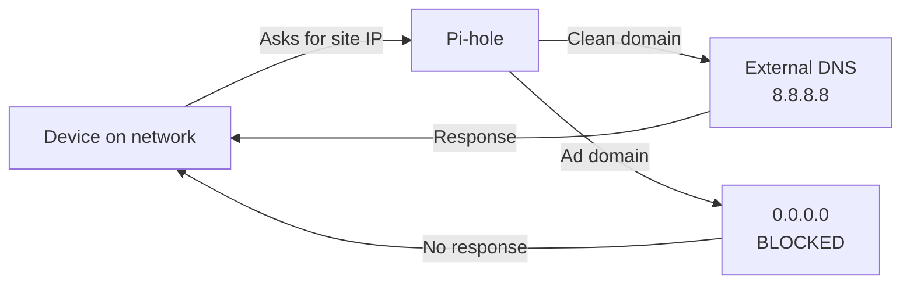

# Pi-hole - My Network-Wide Ad Blocker

**Updated:** June 2026

---


*Pi-hole runs on the Qosmio server inside Docker*

---

## Traffic Flow



---

## What this project demonstrates

| Skill | Application |
|-------|-------------|
| **DNS** | Local DNS server configuration and administration (Pi-hole) |
| **DHCP** | pfSense integration for automatic DNS distribution across the network |
| **Docker** | Container deploy and maintenance in production |
| **Networking** | DNS flow understanding, name resolution, fallback configuration |
| **Troubleshooting** | DNS failure resolution, domain whitelisting |
| **Security** | Network-wide ad and tracker blocking |

---

## What it does

**Pi-hole** is a DNS server that blocks ads and trackers **at the network level**. This means I do not need to install anything on any device — everything that goes through the router goes through Pi-hole first, and ads are filtered before reaching any device.

In simple terms:
- You open a website
- Before loading, the browser asks "what is the IP of this site?"
- Pi-hole answers — but if it's an ad domain, **it doesn't answer** — the ad simply doesn't appear
- Result: less traffic, faster pages, fewer trackers

---

## The Setup

Pi-hole runs inside **Docker** on the Qosmio server (192.168.1.76), alongside Nextcloud and other services.

### Verify it's working

```bash
# From any PC on the network, test DNS
nslookup google.com 192.168.1.76
# Result: Server: pi.hole  Address: 192.168.1.76

# Test ad blocking
nslookup doubleclick.net 192.168.1.76
# Result: Addresses: :: 0.0.0.0  ← blocked!
```

### The container

```bash
docker ps --filter name=pihole --format "table {{.Names}}\t{{.Status}}\t{{.Ports}}"
```

### Network configuration

In **pfSense**, the primary DNS is pointed to the server IP:

```
Services > DHCP Server > LAN
DNS Servers: [IP-SERVIDOR]  (192.168.1.76)
```

This means every device on the network (phones, TVs, laptops) uses Pi-hole as their DNS automatically — no installation needed.

The DNS server name shows up as **pi.hole** when queried from the network.

---

## Daily Impact

The Pi-hole dashboard shows:
- **Total queries** — how many DNS requests passed through
- **Blocked queries** — percentage of blocked traffic
- **Top domains** — most requested sites on the network
- **Top clients** — which devices make the most requests

In my setup, Pi-hole blocks about **20-30%** of all DNS traffic. These are ads and trackers that never reach the devices at home.

---

## What I Learned

- **DNS seems simple until it stops working** — understanding how DNS works on the network was one of the most useful things I learned
- **A single container for DNS** — Pi-hole uses almost zero resources (CPU/RAM), but the daily impact is huge
- **Whitelisting matters** — over-blocking can break websites. The key is monitoring and adjusting

---

*Personal project. Learned about DNS, DHCP, Docker, and why even a small container can make a big difference.*
