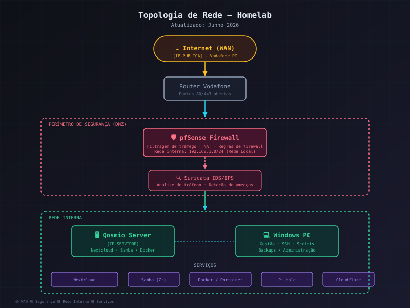
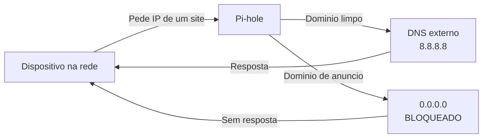

# Pi-hole - O Meu Bloqueador de Anúncios Na Rede Toda

**Atualizado:** Junho 2026

---


*O Pi-hole está no servidor Qosmio, dentro de Docker*

---

## Fluxo de tráfego



---

## O que este projeto demonstra

| Competência | Como se aplica |
|------------|----------------|
| **DNS** | Configuração e administração de servidor DNS local (Pi-hole) |
| **DHCP** | Integração com pfSense para distribuição automática de DNS na rede |
| **Docker** | Deploy e manutenção de container em produção |
| **Redes** | Compreensão de fluxo de DNS, resolução de nomes, fallback |
| **Troubleshooting** | Resolução de falhas de DNS e whitelist de domínios |
| **Segurança** | Bloqueio de rastreadores e anúncios ao nível da rede |

---

## Para que serve isto

O **Pi-hole** é um servidor DNS que bloqueia anúncios e rastreadores **ao nível da rede**. Isto significa que não preciso de instalar nada em nenhum dispositivo — tudo o que passa pelo router passa primeiro pelo Pi-hole e os anúncios são filtrados antes de chegar aos dispositivos.

Basicamente:
- Abres um site qualquer
- Antes de carregar, o browser pergunta "qual é o IP deste site?"
- O Pi-hole responde, mas se for um domínio de anúncio conhecido, **não responde** — o anúncio simplesmente não aparece
- Resultado: menos tráfego, páginas mais rápidas, menos rastreadores

---

## O Setup

O Pi-hole corre dentro de **Docker** no servidor Qosmio (192.168.1.76), ao lado do Nextcloud e outros serviços.

### Verificar que está a funcionar

```bash
# De qualquer PC na rede, testar DNS
nslookup google.com 192.168.1.76
# Resultado: Server: pi.hole  Address: 192.168.1.76

# Testar bloqueio de anúncios
nslookup doubleclick.net 192.168.1.76
# Resultado: Addresses: :: 0.0.0.0  ← bloqueado!
```

### O container

```bash
docker ps --filter name=pihole --format "table {{.Names}}\t{{.Status}}\t{{.Ports}}"
```

### Como está configurado na rede

No **pfSense**, o DNS primário está apontado para o IP do servidor:

```
Services > DHCP Server > LAN
DNS Servers: [IP-SERVIDOR]  (192.168.1.76)
```

Isto faz com que todos os dispositivos na rede (telemóveis, TVs, portáteis) usem o Pi-hole como DNS automaticamente — sem instalar nada neles.

O nome do servidor DNS aparece como **pi.hole** quando consultas um域名 da rede.

---

## O Que Acontece No Dia a Dia

O painel do Pi-hole mostra:

- **Queries totais** — quantos pedidos DNS passaram por ele
- **Bloqueadas** — quantas foram bloqueadas (% de bloqueio)
- **Top domínios** — quais os sites mais pedidos na rede
- **Top clientes** — quais os dispositivos que mais fazem pedidos

No meu caso, o Pi-hole bloqueia cerca de **20-30%** de todo o tráfego DNS. Isto são anúncios e rastreadores que nunca chegam a carregar nos dispositivos de casa.

---

## O Impacto Real

| Antes do Pi-hole | Depois do Pi-hole |
|------------------|-------------------|
| Anúncios em todos os dispositivos da rede | Rede sem anúncios |
| Sites lentos cheios de rastreadores | Sites carregam visivelmente mais rápido |
| Dispositivos a fazer pedidos para tracking desconhecido | Tráfego bloqueado na origem |

O Pi-hole faz o seu trabalho sem ninguém precisar de saber que existe. A internet funciona como antes, só que sem anúncios.

---

## Problemas Que Já Tive

**"Internet deixou de funcionar"** — Aconteceu quando o container do Pi-hole foi abaixo e o router ainda estava a apontar para ele. Solução: configurei o pfSense com um DNS secundário (8.8.8.8) para fallback.

**"Algum site não carrega bem"** — O Pi-hole às vezes bloqueia domínios legítimos. No painel admin, vou a "Query Log", encontro o domínio e faço "Whitelist". Rápido de resolver.

---

## O Que Aprendi

- **DNS parece simples até deixar de funcionar** — perceber como o DNS funciona na rede foi uma das coisas mais úteis que aprendi
- **Um container só para DNS** — o Pi-hole é mínino em recursos (cpu/ram quase zero), mas o impacto no dia a dia é enorme
- **Whitelist é importante** — bloquear demais pode partir sites. O segredo é monitorizar e ajustar

---

## Links Úteis

- Painel do Pi-hole: `http://[IP-SERVIDOR]:8053/admin`
- Lista de bloqueio padrão: incluída no Pi-hole
- Listas extra que adicionei: OISD, NoTracking

---

*Projeto pessoal. Aprendi sobre DNS, DHCP, Docker e porque é que até um container pequeno pode fazer uma grande diferença.*
